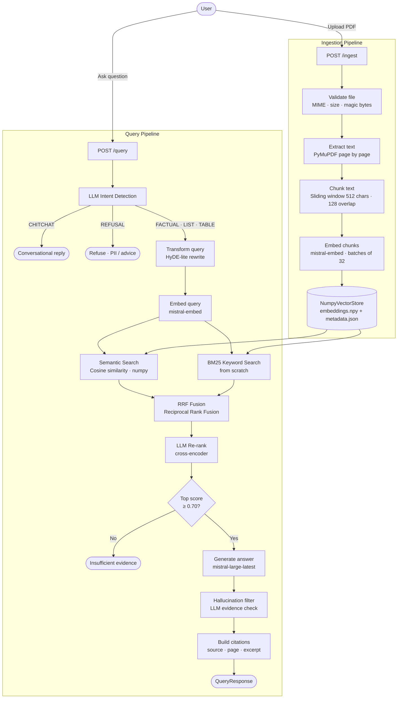

# StackAI RAG

A Retrieval-Augmented Generation (RAG) backend built with FastAPI and Mistral AI. Upload PDF files and ask natural-language questions — the system retrieves the most relevant content and generates grounded, cited answers.

---

## Project Structure

```
rag-pipeline/
├── main.py          # FastAPI app — defines all API endpoints
├── ingestion.py     # PDF validation, text extraction, chunking, and embedding
├── retrieval.py     # Query transformation, semantic search, BM25, RRF fusion, re-ranking
├── generation.py    # Intent detection, prompt building, LLM generation, hallucination filter
├── storage.py       # NumpyVectorStore — in-memory vector store with disk persistence
├── models.py        # Pydantic schemas for all requests and responses
├── config.py        # All constants and environment variables
├── requirements.txt # Python dependencies
├── .env.example     # Environment variable template
├── screenshots/     # UI screenshots
└── ui/
    └── app.py       # Streamlit chat interface
```

---

## System Design

### Architecture Overview

```
┌─────────────────────────────────────────────────────────────────┐
│                        Streamlit UI                             │
│           (upload PDFs · ask questions · view citations)        │
└────────────────────┬───────────────────┬────────────────────────┘
                     │  POST /ingest      │  POST /query
                     ▼                   ▼
┌─────────────────────────────────────────────────────────────────┐
│                      FastAPI Backend                            │
│  ┌─────────────┐   ┌──────────────┐   ┌──────────────────────┐ │
│  │ ingestion.py│   │ retrieval.py │   │    generation.py     │ │
│  │             │   │              │   │                      │ │
│  │ 1. Validate │   │ 1. Transform │   │ 1. Detect intent     │ │
│  │ 2. Extract  │   │ 2. Embed     │   │ 2. Build prompt      │ │
│  │ 3. Chunk    │   │ 3. Cosine    │   │ 3. Call Mistral      │ │
│  │ 4. Embed    │   │ 4. BM25      │   │ 4. Hallucin. filter  │ │
│  │ 5. Store    │   │ 5. RRF fuse  │   │ 5. Build citations   │ │
│  └──────┬──────┘   └──────┬───────┘   └──────────────────────┘ │
└─────────│─────────────────│──────────────────────────────────────┘
          ▼                 ▼
┌─────────────────────────────────────────────────────────────────┐
│                      storage.py                                 │
│        NumpyVectorStore (embeddings.npy + metadata.json)        │
│        In-memory · disk-persisted · no third-party vector DB    │
└─────────────────────────────────────────────────────────────────┘
          │
          ▼
┌─────────────────────────────────────────────────────────────────┐
│                    Mistral AI API                               │
│   mistral-embed (embeddings)  ·  mistral-large-latest (chat)   │
└─────────────────────────────────────────────────────────────────┘
```

---

## Workflow Diagram



---

## Screenshots

**1. UI after ingesting a PDF (867 chunks stored)**


**2. Ingesting a second PDF**


**3. Both PDFs ingested (1217 chunks)**


**4. Multi-source factual query with citations**


**5. Refusal intent — financial advice query**


---

## How It Works

### 1. Data Ingestion (`/ingest`)

When you upload a PDF:

1. **Validation** — MIME type, file size (max 20 MB), PDF magic bytes, filename sanitisation
2. **Text extraction** — PyMuPDF extracts text page by page; near-empty pages are skipped
3. **Chunking** — Sliding window (512 chars, 128 overlap) respecting sentence boundaries
4. **Embedding** — Chunks are sent to Mistral's `mistral-embed` in batches of 32
5. **Storage** — Vectors saved to `data/vectors/embeddings.npy`; metadata to `data/vectors/metadata.json`

#### Chunking Considerations

- **Chunk size (512 chars)** — Small enough to keep each chunk focused on one topic; large enough to preserve sentence context. Larger chunks improve recall but hurt precision; smaller chunks improve precision but risk losing surrounding context.
- **Overlap (128 chars)** — Ensures sentences near chunk boundaries appear fully in at least one chunk. Zero overlap risks cutting key sentences in half; too much overlap inflates the vector store with near-duplicate content.
- **Sentence boundary splitting** — Chunks split at sentence ends where possible, not mid-sentence. Splitting mid-sentence produces incoherent embeddings that reduce retrieval quality.
- **Table preservation** — Pages detected as tables are stored as a single enriched chunk with a `[Table: ...]` header rather than split. Splitting a table across chunks destroys row/column context and makes structured data unrecoverable.
- **Table detection heuristic** — `_is_table_heavy()` scores a page on 3 signals: >50% short lines, >25% numeric lines, >20% column-spaced lines. Any 2 of 3 triggers table mode — robust enough to catch financial tables without false-positives on normal prose.
- **Deterministic chunk IDs** — chunk IDs are MD5 hashes of `file + page + content[:50]`. Re-ingesting the same file produces the same IDs, which is the foundation for future deduplication.
- **Whitespace normalisation** — consecutive blank lines are collapsed to `\n\n` before chunking to prevent formatting artifacts from producing noise chunks.
- **Near-empty page skipping** — Pages with fewer than 20 characters are skipped. They add noise to the vector store and dilute retrieval results with blank or header-only content.

---

### 2. Query Processing (`/query`)

When you ask a question:

1. **Intent detection** — LLM classifies the query into one of five intents:
   - `CHITCHAT` → respond conversationally, skip retrieval
   - `REFUSAL` → PII detected, financial/legal/medical advice → refuse
   - `LIST` → answer formatted as bullets
   - `TABLE` → answer formatted as Markdown table
   - `FACTUAL` → standard concise answer

2. **Query transformation** — HyDE-lite: rewrites the question as a declarative statement closer in style to document text, improving embedding match quality

3. **Hybrid retrieval**:
   - **Semantic search** — cosine similarity (numpy matrix multiply, no external lib)
   - **BM25 keyword search** — implemented from scratch; catches exact keyword/name/date matches that semantic search can miss
   - **RRF fusion** — Reciprocal Rank Fusion merges both ranked lists using rank position only (robust to score scale differences)

4. **LLM re-ranking** — top candidates are re-ranked by the LLM as a cross-encoder for final relevance ordering

5. **Threshold filter** — If the top cosine score < 0.70, returns "insufficient evidence" instead of hallucinating

6. **Generation** — Mistral `mistral-large-latest` called with:
   - Intent-specific system prompt (factual / list / table)
   - Numbered context block with source labels
   - Instruction to cite inline as `[source: filename, page N]`

7. **Hallucination filter** — Post-hoc LLM evidence check: the answer is sent back to the LLM alongside the source chunks; any sentences not supported by the context are flagged

8. **Citations** — Source file + page number + excerpt attached to every response

---

## Key Design Decisions & Tradeoffs

| Decision | Why |
|---|---|
| No third-party vector DB | Required, also removes operational complexity |
| numpy cosine similarity | Standard implementation; O(N) per query is fast enough for thousands of chunks |
| BM25 from scratch | Implemented using Python math only; no external search library used |
| RRF over weighted averaging | Score scales differ between cosine and BM25; rank-based fusion needs no tuning |
| LLM intent detection | Rule-based keyword matching is brittle; LLM handles any phrasing naturally |
| Sliding window chunks | Prevents context loss at chunk boundaries |
| Abstract VectorStore | `NumpyVectorStore` is swappable — replace with Pinecone/Weaviate by implementing the same interface |

---

## Scalability

- **Storage** — `VectorStoreBase` abstract class means replacing numpy with a distributed vector DB is a one-line change
- **Async endpoints** — All FastAPI endpoints are `async`; Mistral calls are I/O-bound and yield the event loop
- **Stateless app layer** — All state is in `data/vectors/`. Point multiple app instances at a shared volume for horizontal scaling
- **Batch embedding** — 32 chunks per API call instead of N calls; reduces latency and API costs linearly

---

## Security

- API key loaded from `.env` — never hardcoded
- File upload validation: MIME whitelist, size limit, magic bytes check, filename sanitisation
- PII regex patterns (SSN, credit card, email) checked before any LLM call
- LLM intent detection handles financial/legal/medical refusals naturally
- Rate limiting: 10/min on `/ingest`, 30/min on `/query`
- CORS restricted to `localhost:8501` (Streamlit)
- Global exception handler — no stack traces exposed to clients

---

## Libraries Used

| Library | Purpose | Link |
|---|---|---|
| FastAPI | API framework | https://fastapi.tiangolo.com |
| Uvicorn | ASGI server | https://www.uvicorn.org |
| Mistral AI | LLM + embeddings | https://docs.mistral.ai |
| PyMuPDF | PDF text extraction | https://pymupdf.readthedocs.io |
| NumPy | Vector arithmetic, cosine similarity | https://numpy.org |
| slowapi | Rate limiting | https://github.com/laurentS/slowapi |
| Streamlit | UI | https://streamlit.io |
| python-dotenv | Env var loading | https://github.com/theskumar/python-dotenv |

---

## Setup & Running

### 1. Install dependencies

```bash
cd rag-pipeline
python -m venv .venv
source .venv/bin/activate      # Windows: .venv\Scripts\activate
pip install -r requirements.txt
```

### 2. Set your API key

```bash
cp .env.example .env
# Edit .env and set MISTRAL_API_KEY=your_key_here
```

### 3. Run the backend

> The `data/vectors/` directory is created automatically on first ingest — no manual setup needed. It will contain `embeddings.npy` (chunk vectors) and `metadata.json` (source file, page number, and text for each chunk).

```bash
uvicorn main:app --reload
# API running at http://localhost:8000
# Swagger UI at http://localhost:8000/docs
```

### 4. Start the UI

```bash
streamlit run ui/app.py
# UI running at http://localhost:8501
```

---

## API Reference

**`GET /health`** — Check if the backend is online and how many chunks are stored.
```bash
curl http://localhost:8000/health
```

**`GET /files`** — List all filenames currently in the knowledge base.
```bash
curl http://localhost:8000/files
```

**`POST /ingest`** — Upload one or more PDF files into the knowledge base.
```bash
curl -X POST http://localhost:8000/ingest -F "files=@/path/to/your.pdf"
```

**`POST /query`** — Ask a natural-language question against the ingested documents.
```bash
curl -X POST http://localhost:8000/query -H "Content-Type: application/json" -d '{"question": "What is the main topic?"}'
```

**`POST /remove`** — Remove all chunks for a specific file from the knowledge base.
```bash
curl -X POST http://localhost:8000/remove -H "Content-Type: application/json" -d '{"filename": "your.pdf"}'
```

**`POST /clear`** — Wipe the entire knowledge base.
```bash
curl -X POST http://localhost:8000/clear
```

Visit `http://localhost:8000/docs` for interactive Swagger UI.

---

## Limitations

- **PDF only** — no Word, Excel, or plain text support; scanned/image PDFs are not supported (no OCR)
- **In-memory store** — the entire vector store is loaded into RAM; impractical beyond ~100k chunks on a standard machine
- **Single process** — the numpy store is not thread-safe for concurrent writes; parallel ingestion requests could corrupt state
- **LLM latency** — each query makes 3–4 Mistral API calls (intent, transform, generate, hallucination check); some queries can take 5–10 seconds
- **Session state only** — chat history is lost on full browser refresh; no persistence across sessions

---

## Future Work

- **Image PDF support** — add OCR to handle scanned or image-based PDFs that contain no extractable text
- **Multi-format ingestion** — extend the pipeline to support Word, Excel, and plain text files
- **Persistent chat history** — store conversations in a local database (SQLite) so history survives page refreshes
- **Distributed vector store** — swap `NumpyVectorStore` for Pinecone or Weaviate using the existing `VectorStoreBase` interface
- **User authentication** — add API key or OAuth2 auth so multiple users can have isolated knowledge bases

